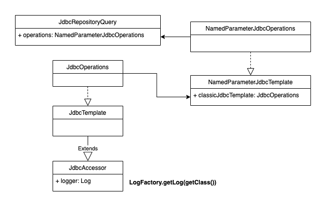

# 4.9. Logging
Spring Data JDBC는 자체적으로는 로그를 남기지 않는다. 대신 내부적으로 SQL문을 생성하기 위해 `JdbcTemplate`을 사용하고 있고, `JdbcTemplate`은 로깅을 제공한다. 실제로 실행되는 SQL문을 보고 싶다면, `NamedParameterJdbcTemplate` 혹은 MyBatis의 로깅을 활성화하라.

> 테스트 스코프 로그 레벨 설정시 `src/test/resources` 디렉토리에 `application.properties` 파일로는 설정이 불가능한 오류 있습니다. `logback-test.xml` 파일로 로거 설정 해주어야 정상 동작합니다.

**logback-test.xml**
```xml
<?xml version="1.0" encoding="UTF-8"?>
<configuration>
    <include resource="org/springframework/boot/logging/logback/console-appender.xml" />
    <logger name="org.springframework.jdbc.core.JdbcTemplate" level="DEBUG"/>
    <root level="ERROR">
        <appender-ref ref="CONSOLE" />
    </root>
</configuration>
```

**CustomerRepositoryTest 실행 결과**
```

  .   ____          _            __ _ _
 /\\ / ___'_ __ _ _(_)_ __  __ _ \ \ \ \
( ( )\___ | '_ | '_| | '_ \/ _` | \ \ \ \
 \\/  ___)| |_)| | | | | || (_| |  ) ) ) )
  '  |____| .__|_| |_|_| |_\__, | / / / /
 =========|_|==============|___/=/_/_/_/
 :: Spring Boot ::        (v2.2.3.RELEASE)

2020-02-18 18:47:14.962  INFO 32022 --- [           main] .s.d.r.c.RepositoryConfigurationDelegate : Bootstrapping Spring Data JDBC repositories in DEFAULT mode.
2020-02-18 18:47:15.062  INFO 32022 --- [           main] .s.d.r.c.RepositoryConfigurationDelegate : Finished Spring Data repository scanning in 94ms. Found 8 JDBC repository interfaces.

============test 1==================
2020-02-18 18:47:17.057 DEBUG 32022 --- [           main] o.s.jdbc.core.JdbcTemplate               : Executing SQL update and returning generated keys
2020-02-18 18:47:17.057 DEBUG 32022 --- [           main] o.s.jdbc.core.JdbcTemplate               : Executing prepared SQL statement [INSERT INTO customer (first_name, last_name, birthday) VALUES (?, ?, ?)]
2020-02-18 18:47:17.101 DEBUG 32022 --- [           main] o.s.jdbc.core.JdbcTemplate               : Executing prepared SQL query
2020-02-18 18:47:17.102 DEBUG 32022 --- [           main] o.s.jdbc.core.JdbcTemplate               : Executing prepared SQL statement [SELECT customer.id AS id, address.customer AS address_customer, customer.birthday AS birthday, customer.last_name AS last_name, customer.first_name AS first_name, address.city AS address_city, address.street AS address_street, address.zip_code AS address_zip_code FROM customer LEFT OUTER JOIN address AS address ON address.customer = customer.id]
Customer(id=0, firstName=taeyeon, lastName=kim, birthday=1991-08-06, address=null)
============test 2==================
2020-02-18 18:47:17.124 DEBUG 32022 --- [           main] o.s.jdbc.core.JdbcTemplate               : Executing prepared SQL update
2020-02-18 18:47:17.124 DEBUG 32022 --- [           main] o.s.jdbc.core.JdbcTemplate               : Executing prepared SQL statement [DELETE FROM address WHERE address.customer = ?]
2020-02-18 18:47:17.129 DEBUG 32022 --- [           main] o.s.jdbc.core.JdbcTemplate               : SQLWarning ignored: SQL state '02000', error code '-1100', message [no data]
2020-02-18 18:47:17.138 DEBUG 32022 --- [           main] o.s.jdbc.core.JdbcTemplate               : Executing prepared SQL update
2020-02-18 18:47:17.138 DEBUG 32022 --- [           main] o.s.jdbc.core.JdbcTemplate               : Executing prepared SQL statement [UPDATE customer SET first_name = ?, last_name = ?, birthday = ? WHERE customer.id = ?]
2020-02-18 18:47:17.141 DEBUG 32022 --- [           main] o.s.jdbc.core.JdbcTemplate               : Executing SQL update and returning generated keys
2020-02-18 18:47:17.141 DEBUG 32022 --- [           main] o.s.jdbc.core.JdbcTemplate               : Executing prepared SQL statement [INSERT INTO address (city, street, zip_code, customer) VALUES (?, ?, ?, ?)]
2020-02-18 18:47:17.142 DEBUG 32022 --- [           main] o.s.jdbc.core.JdbcTemplate               : Executing prepared SQL query
2020-02-18 18:47:17.142 DEBUG 32022 --- [           main] o.s.jdbc.core.JdbcTemplate               : Executing prepared SQL statement [SELECT customer.id AS id, address.customer AS address_customer, customer.birthday AS birthday, customer.last_name AS last_name, customer.first_name AS first_name, address.city AS address_city, address.street AS address_street, address.zip_code AS address_zip_code FROM customer LEFT OUTER JOIN address AS address ON address.customer = customer.id]
Customer(id=0, firstName=taeyeon, lastName=kim, birthday=1991-08-06, address=Address(city=seoul, street=jayang, zipCode=123123))
============test 3==================
2020-02-18 18:47:17.145 DEBUG 32022 --- [           main] o.s.jdbc.core.JdbcTemplate               : Executing prepared SQL update
2020-02-18 18:47:17.145 DEBUG 32022 --- [           main] o.s.jdbc.core.JdbcTemplate               : Executing prepared SQL statement [DELETE FROM address WHERE address.customer = ?]
2020-02-18 18:47:17.146 DEBUG 32022 --- [           main] o.s.jdbc.core.JdbcTemplate               : Executing prepared SQL update
2020-02-18 18:47:17.146 DEBUG 32022 --- [           main] o.s.jdbc.core.JdbcTemplate               : Executing prepared SQL statement [UPDATE customer SET first_name = ?, last_name = ?, birthday = ? WHERE customer.id = ?]
2020-02-18 18:47:17.148 DEBUG 32022 --- [           main] o.s.jdbc.core.JdbcTemplate               : Executing SQL update and returning generated keys
2020-02-18 18:47:17.148 DEBUG 32022 --- [           main] o.s.jdbc.core.JdbcTemplate               : Executing prepared SQL statement [INSERT INTO address (city, street, zip_code, customer) VALUES (?, ?, ?, ?)]
2020-02-18 18:47:17.148 DEBUG 32022 --- [           main] o.s.jdbc.core.JdbcTemplate               : Executing prepared SQL query
2020-02-18 18:47:17.148 DEBUG 32022 --- [           main] o.s.jdbc.core.JdbcTemplate               : Executing prepared SQL statement [SELECT customer.id AS id, address.customer AS address_customer, customer.birthday AS birthday, customer.last_name AS last_name, customer.first_name AS first_name, address.city AS address_city, address.street AS address_street, address.zip_code AS address_zip_code FROM customer LEFT OUTER JOIN address AS address ON address.customer = customer.id]
Customer(id=0, firstName=taeyeon, lastName=kim, birthday=1991-08-06, address=Address(city=seoul, street=bundang, zipCode=345345))
============test 4==================
2020-02-18 18:47:17.151 DEBUG 32022 --- [           main] o.s.jdbc.core.JdbcTemplate               : Executing prepared SQL update
2020-02-18 18:47:17.151 DEBUG 32022 --- [           main] o.s.jdbc.core.JdbcTemplate               : Executing prepared SQL statement [DELETE FROM address WHERE address.customer = ?]
2020-02-18 18:47:17.152 DEBUG 32022 --- [           main] o.s.jdbc.core.JdbcTemplate               : Executing prepared SQL update
2020-02-18 18:47:17.152 DEBUG 32022 --- [           main] o.s.jdbc.core.JdbcTemplate               : Executing prepared SQL statement [UPDATE customer SET first_name = ?, last_name = ?, birthday = ? WHERE customer.id = ?]
2020-02-18 18:47:17.153 DEBUG 32022 --- [           main] o.s.jdbc.core.JdbcTemplate               : Executing prepared SQL query
2020-02-18 18:47:17.153 DEBUG 32022 --- [           main] o.s.jdbc.core.JdbcTemplate               : Executing prepared SQL statement [SELECT customer.id AS id, address.customer AS address_customer, customer.birthday AS birthday, customer.last_name AS last_name, customer.first_name AS first_name, address.city AS address_city, address.street AS address_street, address.zip_code AS address_zip_code FROM customer LEFT OUTER JOIN address AS address ON address.customer = customer.id]
Customer(id=0, firstName=taeyeon, lastName=kim, birthday=1991-08-06, address=null)
============test 5==================
2020-02-18 18:47:17.156 DEBUG 32022 --- [           main] o.s.jdbc.core.JdbcTemplate               : Executing prepared SQL update
2020-02-18 18:47:17.158 DEBUG 32022 --- [           main] o.s.jdbc.core.JdbcTemplate               : Executing prepared SQL statement [DELETE FROM address WHERE address.customer = ?]
2020-02-18 18:47:17.159 DEBUG 32022 --- [           main] o.s.jdbc.core.JdbcTemplate               : SQLWarning ignored: SQL state '02000', error code '-1100', message [no data]
2020-02-18 18:47:17.159 DEBUG 32022 --- [           main] o.s.jdbc.core.JdbcTemplate               : Executing prepared SQL update
2020-02-18 18:47:17.159 DEBUG 32022 --- [           main] o.s.jdbc.core.JdbcTemplate               : Executing prepared SQL statement [UPDATE customer SET first_name = ?, last_name = ?, birthday = ? WHERE customer.id = ?]
2020-02-18 18:47:17.160 DEBUG 32022 --- [           main] o.s.jdbc.core.JdbcTemplate               : Executing SQL update and returning generated keys
2020-02-18 18:47:17.161 DEBUG 32022 --- [           main] o.s.jdbc.core.JdbcTemplate               : Executing prepared SQL statement [INSERT INTO address (city, street, zip_code, customer) VALUES (?, ?, ?, ?)]
2020-02-18 18:47:17.165 DEBUG 32022 --- [           main] o.s.jdbc.core.JdbcTemplate               : Executing prepared SQL update
2020-02-18 18:47:17.165 DEBUG 32022 --- [           main] o.s.jdbc.core.JdbcTemplate               : Executing prepared SQL statement [DELETE FROM address WHERE address.customer = ?]
2020-02-18 18:47:17.166 DEBUG 32022 --- [           main] o.s.jdbc.core.JdbcTemplate               : Executing prepared SQL update
2020-02-18 18:47:17.166 DEBUG 32022 --- [           main] o.s.jdbc.core.JdbcTemplate               : Executing prepared SQL statement [DELETE FROM customer WHERE customer.id = ?]
2020-02-18 18:47:17.170 DEBUG 32022 --- [           main] o.s.jdbc.core.JdbcTemplate               : Executing SQL query [SELECT COUNT(*) FROM customer]
```

실제 수행되는 쿼리가 로깅되는것을 볼 수 있습니다.

## 도큐먼트에서 맘에 안드는 부분
도큐먼트 상에는 `NamedParameterJdbcTemplate` 클래스에 대해서 로그 레벨 설정을 하라고 명시되어 있습니다. 하지만, `NamedParameterJdbcTemplate`는 쿼리 실행을 위해서 `JdbcTemplate`을 사용하고, 실제 로그를 찍는 주체는 `JdbcTemplate` 클래스 이기 때문에 `org.springframework.jdbc.core.JdbcTemplate`에 대해서 로그 레벨 설정을 해주어야 합니다.

  

## References
https://stackoverflow.com/questions/35232827/spring-boot-test-ignores-logging-level
